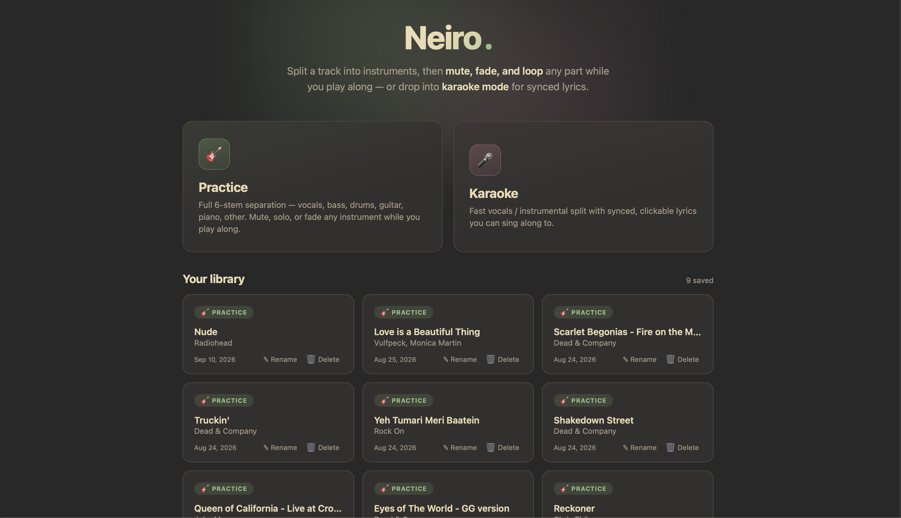
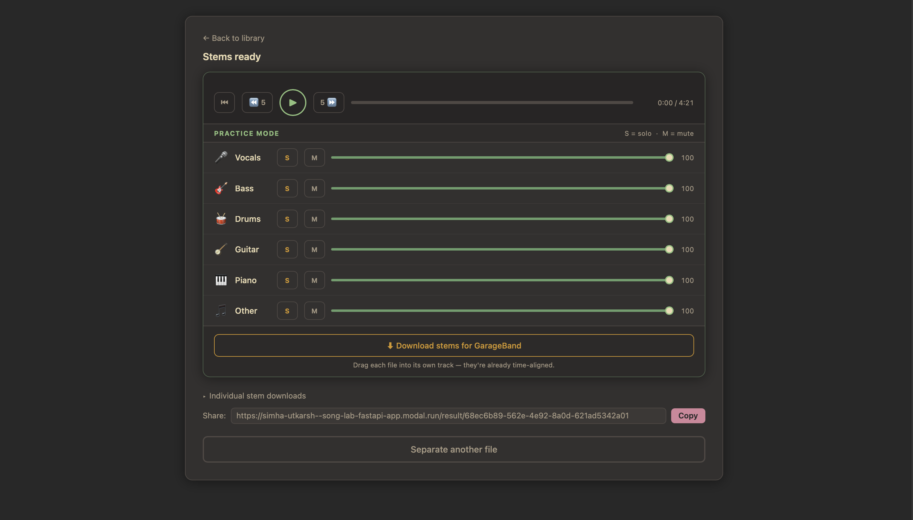

# Neiro

> **/ˈneɪ.roʊ/** — from Japanese 音色 (*neiro*), meaning "timbre" or "tone colour": the quality that distinguishes one sound from another.

Neiro is a collection of tools for analysing songs. It lets you peer inside a piece of music — separating it into its constituent parts and, soon, reading the notes from each instrument.

---

## Screenshots

| Library | Practice mode |
|---|---|
|  |  |

---

## Supported tasks

### Song stem separation

Stem separation splits a mixed audio track into isolated layers — vocals, bass, drums, guitar, piano, and more — so each can be listened to, edited, or analysed independently.

Neiro's separation pipeline is built on [MVSEP-MDX23](https://github.com/jarredou/MVSEP-MDX23-Colab_v2), a weighted ensemble of state-of-the-art deep-learning models. Rather than relying on a single model, it blends the outputs of several specialist networks (BSRoformer, MelBandRoformer, InstVoc, Demucs) to produce cleaner, more robust stems than any single model can achieve alone.

**Separation modes**

| Mode | Stems output | Best for |
|------|-------------|----------|
| **6-stem** *(default)* | vocals · bass · drums · guitar · piano · other | Full song analysis |
| **4-stem** | vocals · bass · drums · other | Quick separation |
| **2-stem** | vocals · instrumental | Karaoke / vocal isolation |

---

## Setup

### 1 — Python environment

Neiro uses [uv](https://docs.astral.sh/uv/) to manage the virtual environment and dependencies.

**Install uv**

```bash
brew install uv          # macOS with Homebrew
```

Or follow the [official installation guide](https://docs.astral.sh/uv/getting-started/installation/) for Linux, Windows, or a curl-based install.

**Install ffmpeg** (required for audio conversion)

```bash
brew install ffmpeg      # macOS
apt install ffmpeg       # Debian / Ubuntu
```

**Clone and install**

```bash
git clone https://github.com/utkarshsimha/neiro
cd neiro
make setup               # creates .venv and installs all deps
```

---

### 2a — Local setup (CPU)

No GPU required. Inference is slower but fully functional.

```bash
make web                 # starts http://localhost:8000
```

---

### 2b — Modal deployment (A10G GPU)

[Modal](https://modal.com) runs Neiro in a serverless GPU container. A new container spins up on demand and shuts down when idle — you only pay for the seconds you use.

**One-time Modal setup**

1. [Create a Modal account](https://modal.com/signup)
2. Install the CLI and authenticate:
   ```bash
   uv run modal token new
   ```

**GPU and cost**

Neiro runs on an **NVIDIA A10G** (24 GB VRAM). Modal charges approximately **$1.10 / hour** for A10G time, billed per second. A 3-minute song typically completes in under 2 minutes of GPU time (~$0.04 per run).

Modal includes **$30 / month in free compute credits** on the free tier — enough for hundreds of separations.

**Deploy**

```bash
make deploy              # builds and deploys to Modal; prints the public URL
```

---

### 3 — R2 storage setup *(optional — shareable links)*

By default, separated stems live only in your browser tab and are lost on refresh. To generate a permanent, shareable link that anyone can open, you need a cloud storage bucket.

Neiro uses [Cloudflare R2](https://www.cloudflare.com/developer-platform/products/r2/) — an S3-compatible object store with no egress fees. When you click *"Create shareable link"* in the UI, the stems are uploaded to your R2 bucket and a UUID-based URL is returned. Anyone with the link can stream the stems for 24 hours.

**Pricing:** **10 GB free storage per month**. Beyond that, $0.015 / GB / month, with no charges for data transfer out.

**Getting R2 credentials**

1. Log in to the [Cloudflare dashboard](https://dash.cloudflare.com/) and subscribe to R2 (requires a payment method; the free tier is generous).
2. Create a bucket — name it `neiro` or anything you like.
3. Go to **R2 → Manage R2 API Tokens → Create API Token**.
4. Grant **Object Read & Write** permissions scoped to your bucket.
5. Note down: **Account ID**, **Access Key ID**, **Secret Access Key**.

**Local (CPU) — `.env` file**

```bash
cp .env.example .env
```

Edit `.env`:

```bash
R2_ACCOUNT_ID=<your-account-id>
R2_ACCESS_KEY_ID=<your-access-key-id>
R2_SECRET_ACCESS_KEY=<your-secret-access-key>
R2_BUCKET_NAME=neiro
```

**Modal (GPU) — Modal secret**

```bash
modal secret create cloudflare-r2 \
  R2_ACCOUNT_ID=<your-account-id> \
  R2_ACCESS_KEY_ID=<your-access-key-id> \
  R2_SECRET_ACCESS_KEY=<your-secret-access-key> \
  R2_BUCKET_NAME=neiro
```

This secret is read automatically at deploy time. You only need to create it once.

---

## CLI usage

```bash
# Separate a file (6-stem, FLAC output)
make run INPUT=song.mp3 OUTPUT=./output

# Force CPU
make run INPUT=song.mp3 CPU=1

# Direct invocation with custom options
uv run python inference.py \
  --input_audio song.mp3 \
  --output_folder ./output \
  --use_BSRoformer --use_Kim_MelRoformer --use_InstVoc \
  --weight_BSRoformer 9.18 --weight_Kim_MelRoformer 10 --weight_InstVoc 3.39 \
  --BigShifts 3 --vocals_only
```

**Makefile targets**

```
make help     Show all targets
make setup    Install all deps (uv sync --extra web)
make web      Run local dev server on :8000
make deploy   Deploy to Modal
make run      Separate a file: make run INPUT=song.mp3 [CPU=1]
make clean    Remove .venv, __pycache__, output/
```

---

## Architecture

```
inference.py          Ensemble separation pipeline — orchestrates model loading,
                      chunked inference, shift-averaging, and stem mixing
app.py                Local FastAPI server — SSE streaming, CPU inference, Modal proxy
modal_app.py          Modal deployment — A10G GPU container + lightweight web container
static/index.html     Web UI — Gruvbox dark theme, inline audio players, R2 share links
modules/              Vendored model implementations (BS-RoFormer, MelBandRoformer,
                      TFC-TDF, VitLarge segmentation)
models/               Model checkpoints — downloaded automatically on first run
```

Pre-trained weights are downloaded automatically to `models/` on first use. Key model sources:

- **6-stem BSRoformer** — [jarredou/BS-ROFO-SW-Fixed](https://huggingface.co/jarredou/BS-ROFO-SW-Fixed) on Hugging Face
- **MelBandRoformer** — [KimberleyJSN/melbandroformer](https://huggingface.co/KimberleyJSN/melbandroformer) on Hugging Face
- **BSRoformer / InstVoc / MDX models** — [TRvlvr model repo](https://github.com/TRvlvr/model_repo)

---

## Future work

### Piano transcription

Once stems are separated, the next step is reading the notes. Neiro plans to integrate [ByteDance's piano transcription model](https://github.com/bytedance/piano_transcription) — trained on 200+ hours of professional piano recordings (MAESTRO dataset) and achieving state-of-the-art onset detection — to convert the isolated piano stem into a MIDI file. Bass transcription will use [Basic Pitch](https://github.com/spotify/basic-pitch).

This will allow Neiro to produce, for any song: **stems** (audio) + **MIDI** (notation) + a **piano roll visualiser** in the browser.

---

## References & attributions

See [NOTICE.txt](./NOTICE.txt) for full licence texts.

- Separation pipeline adapted from [jarredou/MVSEP-MDX23-Colab_v2](https://github.com/jarredou/MVSEP-MDX23-Colab_v2), which builds on [ZFTurbo/MVSEP-MDX23-music-separation-model](https://github.com/ZFTurbo/MVSEP-MDX23-music-separation-model) — MIT Licence
- BSRoformer architecture from [lucidrains/BS-RoFormer](https://github.com/lucidrains/BS-RoFormer) — MIT Licence
- MelBandRoformer from [KimberleyJSN/melbandroformer](https://github.com/KimberleyJSN/melbandroformer)
- Demucs models from [facebookresearch/demucs](https://github.com/facebookresearch/demucs) — MIT Licence
- Pre-trained weights by [Anjok07](https://github.com/Anjok07), [aufr33](https://github.com/aufr33), viperx, and [Kimberley Jensen](https://github.com/KimberleyJensen)
- Piano transcription (planned): [ByteDance/piano_transcription](https://github.com/bytedance/piano_transcription) — MIT Licence
- Bass transcription (planned): [spotify/basic-pitch](https://github.com/spotify/basic-pitch) — Apache 2.0 Licence
